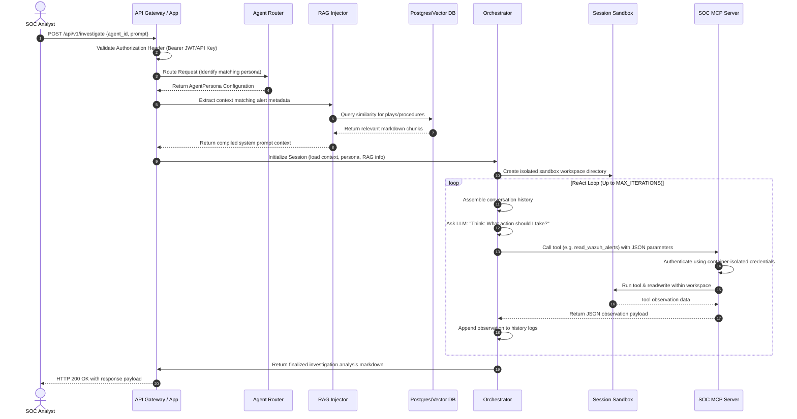
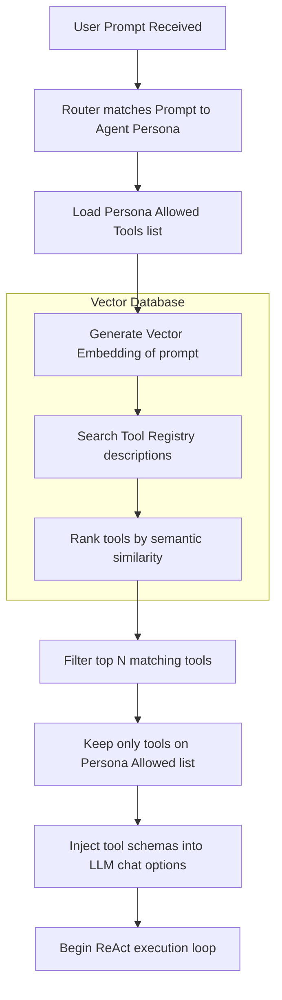
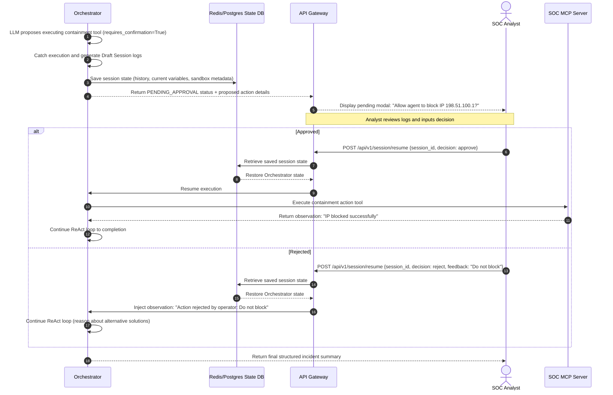

# End-to-End Data Flow

This document details the data pipelines and state transitions inside the BlueTeam / Agentix platform during session execution, dynamic tool selection, and human approval gates.

---

## 1. Request Lifecycle & ReAct Loop Flow

When a user submits an alert investigation request via the API, the system initiates a structured processing flow.

---

## 2. Dynamic Tool Selection Flow

To optimize context window consumption and prevent LLM confusion, we dynamically load tool descriptors into the model instruction on the fly.

---

## 2. HITL Confirmation & State Resume Flow

For sensitive commands (such as firewall modifications or machine isolation), the system halts execution until an analyst manually approves the operation.

