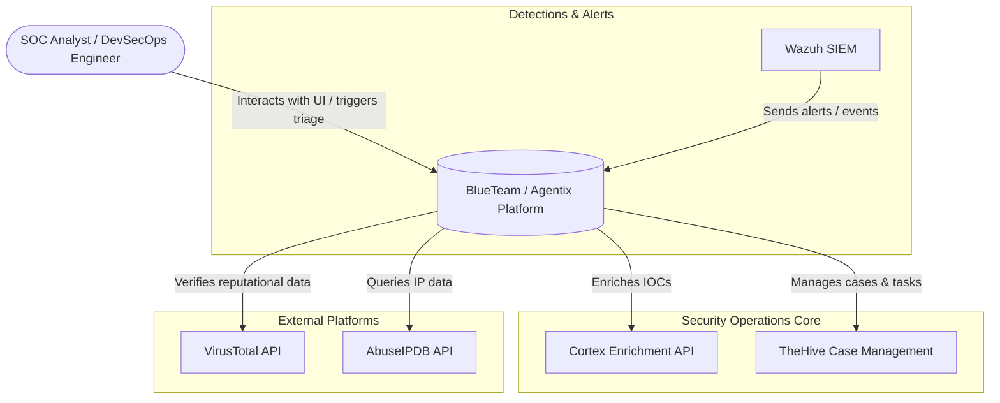
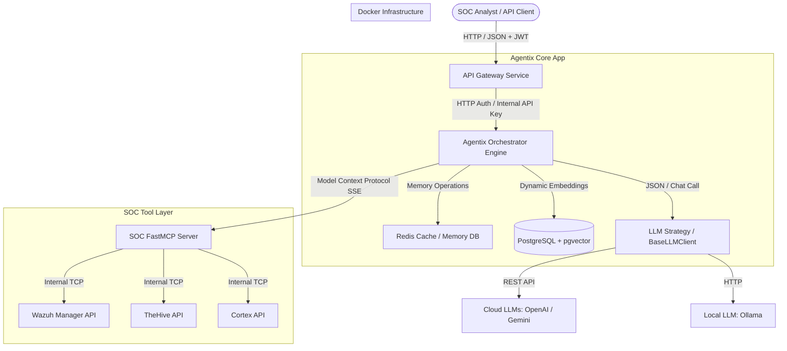
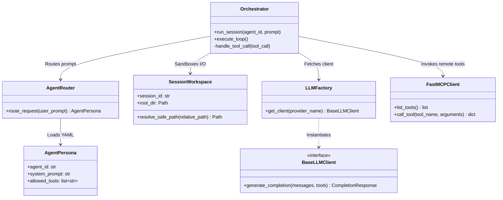

# System Architecture Overview

This document provides a detailed view of the BlueTeam / Agentix architecture using the C4 model for software architecture.

---

## 1. C4 Context Diagram (Level 1)

This diagram shows the system in the context of the external actors and platforms it interacts with.

---

## 2. C4 Container Diagram (Level 2)

This diagram details the containerized services that run within the BlueTeam/Agentix environment and how they communicate.

---

## 3. Component Diagram: Agentix Orchestration Core (Level 3)

This diagram highlights the internal Python modules and classes within the `Agentix` package that control agent behavior.

---

## 4. Architectural Safeguards

1. **Path-Traversal Validation**: The `SessionWorkspace` checks all file path arguments against the workspace root. If a path contains `../` or resolves to a location outside the session folder, it is rejected before any filesystem operations occur.
2. **HITL Gates**: Any tool flagged with `requires_confirmation=True` automatically raises a `PendingApproval` exception. This pauses execution, saves the session state (draft logs), and prompts the operator for approval.
3. **Execution Iteration Cap**: To prevent infinite agent reasoning loops (e.g. LLM getting stuck calling the same failing tool), a maximum iteration limit (`AGENTIX_MAX_ITERATIONS`, defaults to 10) is strictly enforced.
4. **Sandbox Process Group Timeout Isolation**: Subprocesses executed via the sandbox ([executor.py](file:///Users/firatkurt/Documents/Repos/blueTeam/src/Agentix/agentix/sandbox/executor.py)) are instantiated in a dedicated process group (`process_group=0`). When a command times out, the entire process group is killed via `os.killpg(proc.pid, signal.SIGKILL)`, ensuring no orphaned background processes (zombies) remain.
5. **Lightweight Circuit Breaker**: The MCP adapter ([mcp_adapter.py](file:///Users/firatkurt/Documents/Repos/blueTeam/src/Agentix/agentix/tools/mcp_adapter.py)) features a lightweight circuit breaker that tracks downstream tool connection failures. If 5 consecutive failures occur, the circuit opens for 30 seconds, immediately rejecting downstream calls to preserve platform responsiveness.
6. **Dictionary Size Validation**: High-impact tools limit input payload dictionary sizes (e.g. `extra_context` and `data` in [soc_tools.py](file:///Users/firatkurt/Documents/Repos/blueTeam/src/TriageCore/triage_core/tools/soc_tools.py)) to a maximum of 64KB JSON-serialized payload size to prevent memory exhaustion (OOM) or database serialization failures.
7. **Database Migration Advisory Lock**: Database migration execution ([postgres_session.py](file:///Users/firatkurt/Documents/Repos/blueTeam/src/AgenticCommon/agentic_common/memory/postgres_session.py)) employs a session-level PostgreSQL advisory lock (`42424242`) to prevent race conditions or schema corruption when multiple instances run parallel schema upgrades on startup.
