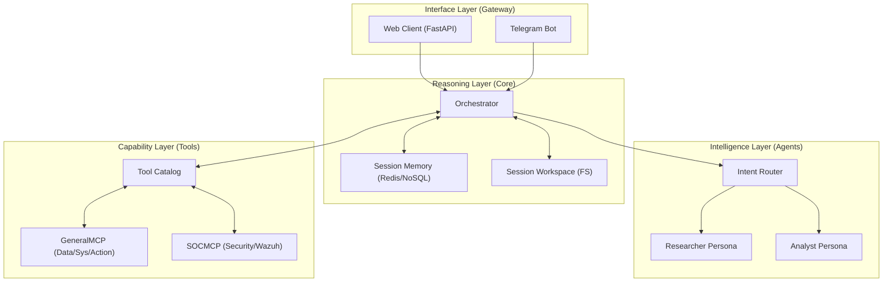

# Agentix: Technical Reference Manual

**Version**: 1.0.0  
**Status**: Production  
**Architecture**: Decoupled Gateway-Core-Agent  

---

## 1. Executive Summary

Agentix is a **Tool-First AI Orchestration Platform** designed for high-autonomy tasks. Unlike traditional chatbots, Agentix is built around the philosophy that an LLM's primary role is to serve as a reasoning engine that selectively employs a vast registry of specialized tools to fulfill user intent.

### Key Value Propositions
- **Dynamic Tool Selection**: Only relevant tools are loaded into the LLM context per request, optimizing for token usage and reasoning accuracy.
- **Strict Isolation**: Every user session operates within a sandboxed file workspace, preventing cross-tenant data leakage and ensuring security.
- **Intent-Based Routing**: Automatically matches user requests to specialized agent personas (e.g., Researcher, Analyst) using semantic similarity.
- **Native RAG Integration**: Knowledge retrieval is performed as a "background injection" rather than an explicit tool call, streamlining the reasoning loop.

---

## 2. Architecture Overview

Agentix utilizes a layered architecture to decouple user interfaces from the core reasoning logic and specialized agent personas.

### High-Level System Architecture

### Components
1.  **Gateway**: Provides channel-specific entry points (REST, Webhooks) and handles authentication.
2.  **Orchestrator**: The central engine driving the ReAct loop and managing resource lifecycle.
3.  **Capability Layer (Tool Catalog)**: A registry that manages tool metadata. It dynamically loads external tools from `GeneralMCP` (utility, file, terminal, web tools) and `SOCMCP` (security platform integration).
4.  **AgenticCommon**: A foundational shared library providing unified Session Workspaces (sandbox), Telemetry, and Database Models.

---

## 3. The Orchestrator (Core Engine)

The Orchestrator is the heart of Agentix, implementing the `Think → Act → Observe → Answer` cycle.

### 3.1 ReAct Loop Implementation
The orchestrator drives a loop (up to a configurable `max_iterations`) where the LLM evaluates the state and chooses the next action.

- **Think**: The LLM analyzes the current history and available tools.
- **Act**: One or more tools are called. Agentix supports **Parallel Tool Execution** via `asyncio.gather`, allowing multiple independent actions in a single turn.
- **Observe**: The output of tool execution is fed back to the LLM.
- **Final Answer**: Once the goal is met, the LLM provides a prefixed response.

### 3.2 Dynamic Tool Selection
To maintain focus and reduce "distraction" from irrelevant tools, the Orchestrator uses the [ToolCatalog.select](./agentix/registry/catalog.py#L106) method. It computes the semantic similarity between the user's message and tool descriptions using embeddings.

### 3.3 Native RAG Integration
Agentix implements a "Native RAG" pattern. Before the ReAct loop starts, the system:
1.  Embeds the user's query.
2.  Searches the vector store for relevant knowledge.
3.  Injects the results directly into the **System Prompt** inside a `<retrieved_context>` block.

This ensures the LLM has the necessary facts without needing to explicitly call a "Search" tool in most cases.

---

## 4. Agent System & Routing

Agentix supports multiple agent personas defined via YAML configurations.

### 4.1 Intent-Based Routing
The [AgentRouter](./agentix/agents/router.py#L19) automatically selects the best agent for a task.
- It compares the user message embedding against the embeddings of agent role descriptions.
- If the similarity score exceeds a threshold (default 0.3), the specific persona is loaded.
- Fallback: If no specific agent matches, the "Generic Orchestrator" is used.

### 4.2 Specialized Personas
- **Researcher**: Prioritizes academic sources (arXiv), downloads PDFs, and synthesizes findings.
- **Analyst**: Focused on data processing, code execution, and report generation.
- **SOC Triage (T1)**: Specialized in autonomous security incident analysis, alert enrichment, and automated response (isolation/blocking).

---

## 5. Tooling Ecosystem & MCP

Tools are the primary way Agentix interacts with the world.

### 5.1 BaseTool Contract
All tools must implement the [BaseTool](./agentix/tools/base.py) interface, defining:
- `name` and `description`.
- `parameters` (JSON Schema).
- `execute()` (Async logic).

### 5.2 Decoupled MCP Servers (FastMCP)
Agentix is natively compatible with the **Model Context Protocol**. It heavily utilizes this architecture by decoupling all significant tools into standalone servers, accessed via the `MCPToolAdapter`:

- **GeneralMCP**: Provides data processing (Docling, Crawl4AI), terminal, file system, and API capabilities.
- **SOCMCP**: Provides high-privilege access to enterprise security tools (Wazuh, TheHive, Cortex) within a highly protected network segment.

This architecture ensures that vulnerabilities in parsing libraries (e.g., Docling) or API credential leaks do not directly compromise the Agentix orchestrator core.

---

## 6. Security & Workspace Isolation

Security is a first-class citizen in Agentix, focused on tenant isolation and safe execution.

### 6.1 Session Workspaces
Every session is allocated a dedicated [SessionWorkspace](./agentix/core/workspace.py).
- **Structure**: `sessions/{session_id}/[downloads, outputs, temp, uploads]`.
- **Path Sandboxing**: All file operations are resolved against the session root. Attempts to access paths outside this root (e.g., via `../../`) trigger a `PermissionError`.
- **Quotas**: Disk usage is tracked per session. Writes are blocked if the quota (e.g., 50MB) is exceeded.

### 6.2 Authentication
The Gateway integrates a **PostgreSQL-backed Local JWT Authentication**.
- Clients authenticate via the `/web/login` endpoint using credentials stored in the `agentix_users` database table (created and seeded automatically on startup).
- A signed JSON Web Token (JWT) is returned upon successful authentication.
- Every subsequent request to protected routers (e.g., `/web/chat`) requires this JWT as a Bearer Token in the `Authorization` header.
- The `owner_id` (extracted from the token's `uid` claim) is used to enforce session ownership, preventing IDOR (Insecure Direct Object Reference) attacks on session data.

---

## 7. Data Flow & Lifecycle

1.  **Request**: User sends a message to `/web/chat` with a `session_id`.
2.  **Auth**: Gateway validates the local JWT Bearer Token and verifies session ownership.
3.  **Routing**: AgentRouter determines if a specialized persona is needed.
4.  **Retrieval**: Native RAG fetches context from the vector store.
5.  **ReAct Loop**: Orchestrator drives the LLM through multiple reasoning/action steps.
6.  **Tool Execution**: Tools run within the `SessionWorkspace`.
7.  **Final Response**: Trace is streamed back to the user via Server-Sent Events (SSE) or WebSockets.

---

## 8. Observability & Operations

### 8.1 Monitoring
Agentix uses **Langfuse** for end-to-end observability. Every trace captures:
- Input/Output tokens.
- Tool call success/failure.
- Latency per step.
- Semantic scores for tool selection.

### 8.2 Logging
Comprehensive structured logging is provided via `structlog`, enabling easy integration with ELK or Datadog.

---

## Appendices

### Glossary
- **ReAct**: Reason + Act; a prompting technique for agentic behavior.
- **HITL**: Human-In-The-Loop; manual approval required for sensitive tools.
- **MCP**: Model Context Protocol; standard for tool/knowledge exchange.

### References
- [Project Repository](https://github.com/kurtfi/blueTeam)
- [OpenAI Function Calling Guide](https://platform.openai.com/docs/guides/function-calling)
